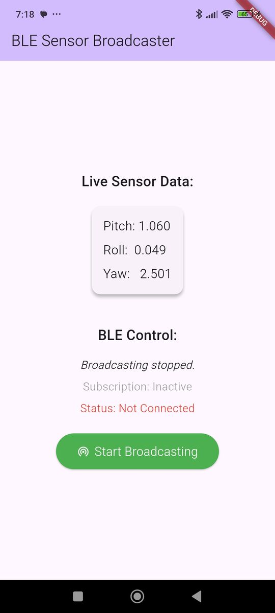

# Flutter BLE Sensor Broadcaster

[](https://opensource.org/license/MIT)




This Flutter application transforms your smartphone into a Bluetooth Low Energy (BLE) peripheral, broadcasting real-time orientation sensor data (pitch, roll, and yaw) to any connected BLE central device.

This project serves as a comprehensive example of integrating native platform features (Android and iOS) into a Flutter application using Method Channels, providing a custom implementation for BLE communication without relying on third-party plugins for peripheral mode.

## 🚀 Features

- **Real-time Sensor Streaming**: Captures live data from the phone's orientation sensor.
- **BLE Peripheral Mode**: Advertises itself as a BLE peripheral with a custom GATT service.
- **Cross-Platform**: A single Dart codebase for both Android and iOS, with platform-specific native code for BLE functionality.
- **Clean Architecture**: Utilizes the BLoC (Business Logic Component) pattern for state management, separating UI from business logic.
- **Custom Native Integration**: Demonstrates the use of `MethodChannel` and `EventChannel` to communicate between Flutter and native code (Java/Kotlin on Android, Swift/Objective-C on iOS).

## 💡 Use Cases

- **Games**: Use the phone's orientation as a controller input.
    - see [flutter_flame_ble_motion_control_demo](https://github.com/IoT-gamer/flutter_flame_ble_motion_control_demo)
        - this app will consume the broadcasted data and move a character in a game.
- **IoT Applications**: Broadcast sensor data to other BLE devices for monitoring or control.

## 🏛️ Architecture Overview

The application is built with a clean, scalable architecture:

- **Flutter (UI & Business Logic)**:
    - **UI Layer (`/lib/ui`)**: Contains the widgets that make up the user interface.
    - **BLoC/Cubit Layer (`/lib/cubits`)**: Manages the application's state.
        - `OrientationCubit`: Manages the state of the phone's orientation sensor.
        - `BleCubit`: Manages the state of the BLE peripheral (e.g., advertising, connected, subscribed).
    - **Repository Layer (`/lib/repositories`)**: Abstracts data sources and communication with native platforms.
        - `OrientationRepository`: Provides a stream of sensor data.
        - `BleRepository`: Handles all communication with the native BLE implementation via method channels.

- **Native Platforms (BLE Implementation)**:
    - **Android (`/android`)**: The `MainActivity.java` file contains the full implementation of a BLE GATT server, handling advertising, connections, and characteristic updates.
    - **iOS (`/ios`)**: The `AppDelegate.swift` file uses the `CoreBluetooth` framework to manage the `CBPeripheralManager`, defining services and characteristics to broadcast the sensor data.

### Communication Flow

1.  **Sensor Data**: `OrientationCubit` listens to a stream of data from the phone's orientation sensor.
2.  **State Update**: The Cubit updates its state with the latest pitch, roll, and yaw values.
3.  **UI Reaction**: The `HomePage` widget rebuilds to display the new sensor data.
4.  **BLE Update**: A `BlocListener` triggers the `BleCubit` to send the new data to the native side.
5.  **Method Channel**: `BleRepository` sends the data over a `MethodChannel` to the native Android/iOS code.
6.  **Native Broadcast**: The native code receives the data and updates the value of the BLE characteristic, notifying any subscribed central devices.
7.  **Native Events**: The native code sends events (like connection status, subscription changes, advertising status) back to Flutter using an `EventChannel`.
8.  **Flutter State Sync**: The `BleCubit` listens to these events and updates the app's state accordingly, ensuring the UI always reflects the true state of the BLE peripheral.

## 📂 Project Structure

```
flutter_ble_sensor_broadcaster/
├── android/app/src/main/java/.../MainActivity.java  # Native Android BLE implementation
├── ios/Runner/AppDelegate.swift                     # Native iOS BLE implementation
├── lib/
│   ├── constants/
│   │   └── ble_constants.dart                       # Centralized BLE constants
│   ├── cubit/
│   │   ├── ble_cubit.dart                           # State management for BLE
│   │   ├── ble_state.dart
│   │   ├── orientation_cubit.dart                   # State management for sensors
│   │   └── orientation_state.dart
│   ├── repositories/
│   │   ├── ble_repository.dart                      # Handles Method/Event Channel communication
│   │   └── orientation_repository.dart              # Provides sensor data stream
│   ├── ui/
│   │   └── home_page.dart                           # Main application screen
│   └── main.dart                                    # App entry point
└── pubspec.yaml
```

## 📱 Platform Support

| Platform | Supported | Tested |
| :------- | :-------: | :----: |
| **Android**| ✅        | ✅     |
| **iOS** | ✅       | ❌     |

## 🛠️ Setup and Installation

1.  **Clone the repository:**
    ```bash
    git clone https://github.com/IoT-gamer/flutter_ble_sensor_broadcaster.git
    cd flutter_ble_sensor_broadcaster
    ```

2.  **Get Flutter dependencies:**
    ```bash
    flutter pub get
    ```

3.  **Run the application:**
    Connect a device or start an emulator/simulator and run:
    ```bash
    flutter run
    ```

## ⚙️ How It Works

### 1. Permissions
The app first requests necessary Bluetooth permissions for the specific platform (`BLUETOOTH_SCAN`, `BLUETOOTH_CONNECT`, `BLUETOOTH_ADVERTISE` on Android; `Bluetooth` on iOS).

### 2. Initialization
Once permissions are granted, the `BleCubit` calls `initialize` on the `BleRepository`. This invokes the corresponding `initialize` method on the native side, setting up the `CBPeripheralManager` (iOS) or `BluetoothGattServer` (Android).

### 3. Starting the Broadcast
-   Tapping the "Start Broadcasting" button calls `startAdvertising()` in the `BleCubit`.
-   This command is passed through the `BleRepository` via a Method Channel to the native code.
-   The native code starts advertising a specific BLE Service UUID.
-   The native code sends an `advertisingStatus` event back to Flutter via the `EventChannel`, and the UI updates to show "Stop Broadcasting".

### 4. Streaming Data
-   When a BLE central device connects and subscribes to the characteristic, the native code sends `connectionState` and `subscriptionState` events to Flutter.
-   The `BleCubit` updates its state to `isSubscribed = true`.
-   Now, every time the `OrientationCubit` emits a new sensor reading, the `updateCharacteristic` method is called, sending the data to the native side to be broadcast to the subscriber.

### 5. Stopping the Broadcast
-   Tapping "Stop Broadcasting" calls `stopAdvertising()`.
-   The command is sent to the native platform, which stops the BLE advertisement.
-   An `advertisingStatus` event is sent back, and the UI button reverts to "Start Broadcasting".

This robust, event-driven architecture ensures that the Flutter UI and the native BLE stack are always in sync.

## 🔒 Security Considerations
* Pairing and bonding are not implemented in this example.
* Sensor data is not encrypted; consider using secure characteristics for sensitive data.

## 📄 License

This project is licensed under the MIT License - see the [LICENSE](LICENSE) file for details.